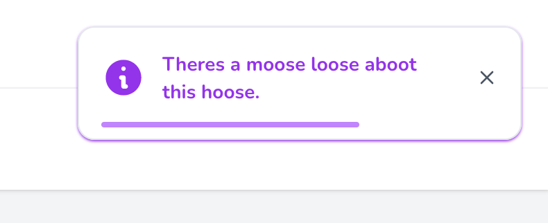
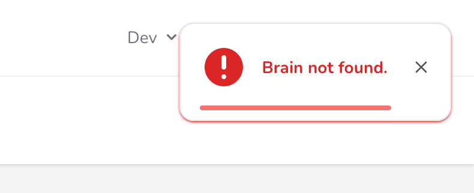

<div align="center">
    
    <h1>Laravel Toastie</h1>
    <p>Simple Toast notifications with built in default designs for ALT stack (Alpine, Laravel, Tailwind) applications with easy options to customise to your hearts content.</p>
</div>

<div align="center">
    <p>
        <a href="https://github.com/othyn/laravel-toastie/actions/workflows/tests.yml">
            
        </a>
        <a href="https://github.com/othyn/laravel-toastie/actions/workflows/stan.yml">
            
        </a>
        <a href="https://github.com/othyn/laravel-toastie/actions/workflows/lint.yml">
            
        </a>
        <a href="https://github.com/othyn/laravel-toastie/actions/workflows/tests.yml">
            
        </a>
        <a href="#floppy_disk-install">
            
        </a>
        <a href="https://github.com/othyn/laravel-toastie/graphs/contributors">
            
        </a>
        <a href="https://github.com/othyn/laravel-toastie/network/members">
            
        </a>
        <a href="https://github.com/othyn/laravel-toastie/stargazers">
            
        </a>
        <a href="https://github.com/othyn/laravel-toastie/issues/">
            
        </a>
        <a href="https://github.com/othyn/laravel-toastie/blob/master/LICENSE">
            
        </a>
    </p>
</div>

<div align="center">
    <h4>
        <a href="#floppy_disk-install">Install Latest Version</a>
        <span> · </span>
        <a href="https://github.com/othyn/laravel-toastie/issues">Report Bug</a>
        <span> · </span>
        <a href="https://github.com/othyn/laravel-toastie/issues">Request Feature</a>
    </h4>
</div>

<!-- Table of Contents -->

## :notebook_with_decorative_cover: Table of Contents

- [About the Project](#star2-about-the-project)
  - [Screenshots](#camera-screenshots)
  - [Tech Stack](#space_invader-tech-stack)
  - [Features](#dart-features)
- [Install](#floppy_disk-install)
  - [Version Matrix](#version-matrix)
- [Usage](#hammer_and_wrench-usage)
  - [Configuration](#wrench-configuration)
  - [PHP API](#elephant-php-api)
  - [Blade Components](#page_facing_up-blade-components)
- [Contributing](#bread-contributing)
  - [Project Tooling Quick Reference](#toolbox-project-tooling-quick-reference)
- [Changelog](https://github.com/othyn/laravel-toastie/releases)
- [License](#warning-license)
- [Acknowledgements](#gem-acknowledgements)

<!-- About the Project -->

## :star2: About the Project

All the other Laravel Toast libraries out there seemed to have nailed the API for creating Toasts, but the key areas they were lacking in are keeping up to date and :sparkles: style :sparkles:.

This package aims to solve that by providing a default set of Toasts that look good and are easy to use, with it being very easy to change up the design if you hate the look of them and roll your own!

Toastie has support for 4 key toast types/states; Success, Info, Warning and Error.

<!-- Screenshots -->

### :camera: Screenshots

<p align="middle">
  
  &nbsp;
  
</p>

<p align="middle">
  
  &nbsp;
  
</p>

<!-- TechStack -->

### :space_invader: Tech Stack

<ul>
    <li>Language: <a href="https://www.php.net/">PHP</a></li>
    <li>Dependency Manager: <a href="https://getcomposer.org/">Composer</a></li>
    <li>Containerisation: <a href="https://www.docker.com/">Docker</a></li>
    <li>Build Tool: <a href="https://www.gnu.org/software/make/manual/html_node/Simple-Makefile.html">Make</a></li>
    <li>Framework: <a href="https://laravel.com/">Laravel</a></li>
    <li>Framework: <a href="https://alpinejs.dev/">Alpine</a></li>
    <li>Framework: <a href="https://tailwindcss.com/">Tailwind</a></li>
    <li>Package: <a href="https://github.com/illuminate/support">illuminate/support</a></li>
    <li>Package: <a href="https://github.com/orchestra/testbench">orchestra/testbench</a></li>
    <li>Package: <a href="https://github.com/pestphp/pest">pestphp/pest</a></li>
    <li>Package: <a href="https://github.com/laravel/pint">laravel/pint</a></li>
    <li>Package: <a href="https://github.com/phpstan/phpstan">phpstan/phpstan</a></li>
</ul>

<!-- Features -->

### :dart: Features

- Simple to use
- Laravelified
- Alpine & Tailwind
- Expressive API
- Auto hide or only on dismiss
- :sparkles: Stylish :sparkles: and modern default design
- Highly customisable
- Cheeky

<!-- Install -->

## :floppy_disk: Install

Installation can be done via [Composer](https://getcomposer.org/):

```sh
$ composer require othyn/laravel-toastie
```

Next you are going to want to head down to the [configuration](#wrench-configuration), so lets get started on [usage](#hammer_and_wrench-usage)! See you there.

### Version Matrix

Here is the current version matrix for project supported versions of used frameworks and libraries.

| Toastie Version | PHP Version | Laravel Version | Alpine Version | Tailwind Verison |
| --------------- | ----------- | --------------- | -------------- | ---------------- |
| `1.0.0`         | `^8.1`      | `^9.24`         | `^3.4.2`       | `^3.1.0`         |

If you require support for an older version of Laravel, submit an issue as we may be able to look into dropping the version requirements down, as I don't think it needs to be this new. Or, feel free to submit a PR!

<!-- Usage -->

## :hammer_and_wrench: Usage

There are three key parts to Toastie;

1. The configuration.
   - Where you can customise Toastie's behaviour.
2. The PHP API.
   - How you can call and action Toastie.
3. The Blade components.
   - How you can render Toastie.

Let's kick things off with the configuration, I'll meet you down there.

### :wrench: Configuration

Hello again! First thing we're going to need to do is publish the configuration so we can set things up how we want them.

We do this my telling Laravel to publish the config file into our working directory, instead of relying on the default one bundled with this package:

```sh
$ php artisan vendor:publish \
    --provider="Othyn\\Toastie\\Providers\\ToastieServiceProvider" \
    --tag="toastie-config"
```

You should now have an `config/toastie.php` file within your project that you can edit. If you go ahead and open it up, you'll see something like:

```php
<?php

declare(strict_types=1);

return [
    'timings' => [
        /*
         * Whether the toasts should automatically close after a specified time.
         *
         * This time can be specified by setting the 'timings.dismiss_delay' value.
         */
        'auto_dismiss' => env('TOASTIE_AUTO_DISMISS', true),

        /*
         * Time, in seconds, that the toast should take to be dismissed when dismissing automatically.
         *
         * REQUIRES the 'timings.auto_dismiss' setting to be enabled.
         */
        'dismiss_delay' => env('TOASTIE_DISMISS_DELAY', 4),
    ],
];
```

Customise this to your hearts content, the configuration options available and a short description are provided above or in your new `config/toastie.php` file.

Let's move onto the PHP API.

### :elephant: PHP API

Calling Toastie can be achieved one of three ways;

- ... via the helper method.
- ... via the Facade.
- ... via a new instance of the class.

Choose whichever way you prefer to do things. I'm partial for the helper method myself, its nice and easy with good IDE type hinting.

#### The helper method

If you prefer taking things easy:

```php
// An info type & style toast
toastie()->info('Remember to pick a movie to watch tonight!');

// A warning type & style toast
toastie()->warning('Its getting late, you should watch that movie...');

// An error type & style toast
toastie()->error('Ran out of popcorn.');

// A success type & style toast
toastie()->success("Watched {$favouriteMovie}.");
```

#### The Facade

If you prefer a more static way of life:

```php
// Remember to include the class!
use Othyn\Toastie\Facades\Toastie;

// ... some ungodly code ...

// An info type & style toast
Toastie::info('Dinner\'s 5 minutes away.');

// A success type & style toast
Toastie::success('Dinner\'s ready!');

// A warning type & style toast
Toastie::warning('Dinner\'s getting cold... you should eat now.');

// An error type & style toast
Toastie::error('Dog ate it.');
```

You'll notice that the Facade has the concrete class as a mixin on the PHPDoc blocks, this so you're IDE will be happy. I know mine is.

#### The class instance

If you like things old school:

```php
// Remember to include the class!
use Othyn\Toastie\Services\Toastie;

// ... some ungodly code ...

// Create the new toastie instance
$toastie = new Toastie();

// ... yet more ungodly code ...

// An info type & style toast
$toastie->info('Hey! How are you? Heads up, the next toast will be a warning.');

// A warning type & style toast
$toastie->warning('Uh-oh! Oh well, the next toast will be a success...');

// A success type & style toast
$toastie->success('Yes! Got the good one. Although the next one\'s going to sting...');

// An error type & style toast
$toastie->error('Ran out of bread.');

// ... when will it end?!

// Oh.
```

Let's move onto the Blade Components.

### :page_facing_up: Blade Components

By default, Toastie ships with a Toast design and paired component for all of the 4 key toast types that it supports. It also has some 'smarter' options and options that allow you to customise the appearance to your heards content whilst retaining Toastie's expressive API.

In order to have Toastie load toasts onto your page, you'll need to do one of three things;

- ... use the 'smart' Shared component to render only the default design but via one Component that dynamically changes; or
- ... add the Blade component directly for the style/type of toast you want to use ([can be overridden](#customising-the-toast-design)); or
- ... use the 'stack' Stack component to load all toasts automatically depending on what is called ([can be overridden](#customising-the-toast-design)).

By 'can be overridden', I'm refering to the fact that under those scenarios the actual underlying component file is loaded, meaning you can publish the views for the project and customise them to your hearts content, completely changing the design if you wish but retaining Toastie's expressive API. If you want to know how to do this, skip ahead to ['Customising the toast design'](#customising-the-toast-design).

Let's kick things off with Toastie's default implementation.

#### Using the dynamic default design

This is the easiest way to maximise the utilisation of Toastie if you are not wanting to change up any of the designs.

```html
<!-- my-view.blade.php -->

<!-- Will render only the required style/type of toast when called -->
<x-toastie::shared />
```

Under the hood, this dynamically renders the default toast design, meaning this one isn't overridable - that functionality is reserved for the next two options so keep reading if that's what you want.

This should be the go to option for people just wanting Toastie to do all the work, so you can kick back and have another sip of coffee. Ahhhhhhhh.

Let's move on.

#### Using individual style/type components

This is the hardest, but most custom, utilisation of the Blade components:

```html
<!-- my-view.blade.php -->

<!-- Will render a success toast when called -->
<x-toastie::success />

<!-- Will render an info toast when called -->
<x-toastie::info />

<!-- Will render a warning toast when called -->
<x-toastie::warning />

<!-- Will render an error toast when called -->
<x-toastie::error />
```

As you can see this is highly customisable, as you can place each toast somewhere different to render if you so wish. If you want to know how to do this, skip ahead to ['Customising the toast design'](#customising-the-toast-design).

But having 4 lines is silly to get you access to all the components, which is where the next component comes in.

#### Lazy loading all components

This is the easiest way to maximise the utilisation of the Blade components whilst still retaining full control of the design:

```html
<!-- my-view.blade.php -->

<!-- Will render only the required style/type of toast when called -->
<x-toastie::stack />
```

By design, this will only ever render the required component should it have been called by you calling Toastie on the last page cycle.

Under the hood, its just pulling in each component directly, meaning if you want to override the styles this will allow you to still render all of the toasts whilst using your nice new designs. If you want to know how to do this, skip ahead to ['Customising the toast design'](#customising-the-toast-design).

#### Customising the toast design

So, don't like that default Toastie design eh? Well then, I suppose I better tell you how to change it. First, we need to publish Toastie's view set into your project so you can customise it:

```sh
$ php artisan vendor:publish \
    --provider="Othyn\\Toastie\\Providers\\ToastieServiceProvider" \
    --tag="toastie-views"
```

You should now have a load of view files appear in a new `resources/views/vendor/toastie/components` directory within your project that you can now edit to your hearts content.

To explain the files that you are seeing, in alphabetical order:

- `error.blade.php`
  - Description: The error toast component.
  - Usage: Used in the `x-toastie::error` and `x-toastie::stack` components.
- `info.blade.php`
  - Description: The info toast component.
  - Usage: Used in the `x-toastie::info` and `x-toastie::stack` components.
- `shared.blade.php`
  - Description: The shared toast component.
  - Usage: Used in the `x-toastie::shared` component.
  - Extra: This is the default dynamic design one, I guess you can override it if you want, its just not designed with that in mind.
- `stack.blade.php`
  - Description: The stack toast component.
  - Usage: Used in the `x-toastie::stack` component.
  - Extra: Renders the `error`, `info`, `success` and `warning` components within it depending on which one has been called, if any.
- `success.blade.php`
  - Description: The success toast component.
  - Usage: Used in the `x-toastie::success` and `x-toastie::stack` components.
- `warning.blade.php`
  - Description: The warning toast component.
  - Usage: Used in the `x-toastie::warning` and `x-toastie::stack` components.

Each Blade component gets access to the following variables:

- `$aToastieShouldBeDisplayed`
  - Type: `Bool`
  - Description: Whether a toast should be displayed _at all_.
- `$shouldBeDisplayed`
  - Type: `Bool`
  - Description: Whether the specific type of toast that the instance is should be displayed.
- `$type`
  - Type: `Othyn\Toastie\Enums\ToastieType`
  - Description: The type of Toastie the instance is being called into being as.
- `$message`
  - Type: `string`
  - Description: The message to be displayed in the toast.
- `$shouldAutoDismiss`
  - Type: `Bool`
  - Description: Whether a toast should auto dismiss.
- `$autoDismissInSeconds`
  - Type: `Integer`
  - Description: How long, in seconds, the toast should take to auto dismiss from when the page loads.
- `$autoDismissInMilliseconds`
  - Type: `Integer`
  - Description: How long, in milliseconds, the toast should take to auto dismiss from when the page loads.
- `$colour`
  - Type: `string`
  - Description: The Tailwind colour class that the component should use.
  - Note: Only available on the default `Shared` Toastie type.
- `$icon`
  - Type: `string`
  - Description: The SVG path string that the component should use to render the toast's icon.
  - Note: Only available on the default `Shared` Toastie type.

<!-- Contributing -->

## :bread: Contributing

See the [contribution guide](CONTRIBUTING.md) on how to get started. Thank you for contributing!

Detailed within that guide are steps on how...

- ... issues should be used.
- ... to setup the project.
- ... branches should be used.
- ... commits should be formatted.
- ... pull requests should be submitted.
- ... build in project tooling; Make, Docker, testing, test coverage, static analysis and linting.
- ... the build process works and the automation that drives it.

### :toolbox: Project Tooling Quick Reference

There are quite a few ease-of-use tools in place to help you manage the project, all of which are masked behind [Make](https://www.gnu.org/software/make/manual/html_node/Simple-Makefile.html) and [Docker](https://www.docker.com/) to make using this project as smooth as possible.

```sh
# Let's get things setup. This will run:
#  - A Docker Compose build.
#  - A Composer install via the now built project Docker container.
$ make setup

# ... happy few hours programming, adding cool new features and smashing bugs ...

# Lets make sure things are formatted correctly.
# This runs Pint (PHP-CS-Fixer) via the projects Docker container.
$ make lint

# Lets make sure things are implemented correctly.
# This runs PHPStan via the projects Docker container.
$ make stan

# Lets make sure things are still functioning as intended. This will:
#  - Run Pest (PHPUnit) and ensure all tests pass via the projects Docker container.
#  - Ensure that we are reaching the 100% code coverage target as part of that process.
$ make test

# If you want a shortcut to; lint, stan and then test all in one go via the projects Docker container
$ make all

# Finally, if you need access to the projects Docker container's shell
$ make shell
```

That's about it, go make something cool and submit a PR!

<!-- License -->

## :warning: License

Distributed under the MIT License. See [LICENSE](https://github.com/othyn/laravel-toastie/blob/main/LICENSE) for more information.

<!-- Acknowledgments -->

## :gem: Acknowledgements

Useful resources and libraries that have been used in the making of this project.

- Readme: [Louis3797/awesome-readme-template](https://github.com/Louis3797/awesome-readme-template)
- Readme: [ikatyang/emoji-cheat-sheet](https://github.com/ikatyang/emoji-cheat-sheet)
- Readme: [shields.io](https://shields.io/)
- Logo: [Toast SVG Vector 63](https://www.svgrepo.com/svg/411761/toast) ([CC Attribution License](https://www.svgrepo.com/page/licensing))
- Design: [Tail-kit](https://www.tailwind-kit.com)
- Package: [illuminate/support](https://github.com/illuminate/support)
- Package: [orchestra/testbench](https://github.com/orchestra/testbench)
- Package: [pestphp/pest](https://github.com/pestphp/pest)
- Package: [laravel/pint](https://github.com/laravel/pint)
- Package: [phpstan/phpstan](https://github.com/phpstan/phpstan)
- Inspiration: (Design) [Tailwind CSS Toast And Notification Example](https://larainfo.com/blogs/tailwind-css-toast-and-notification-example)
- Inspiration: (Design) [Animated dynamic progress bar](https://tailwindcomponents.com/component/animated-dynamic-progress-bar)
